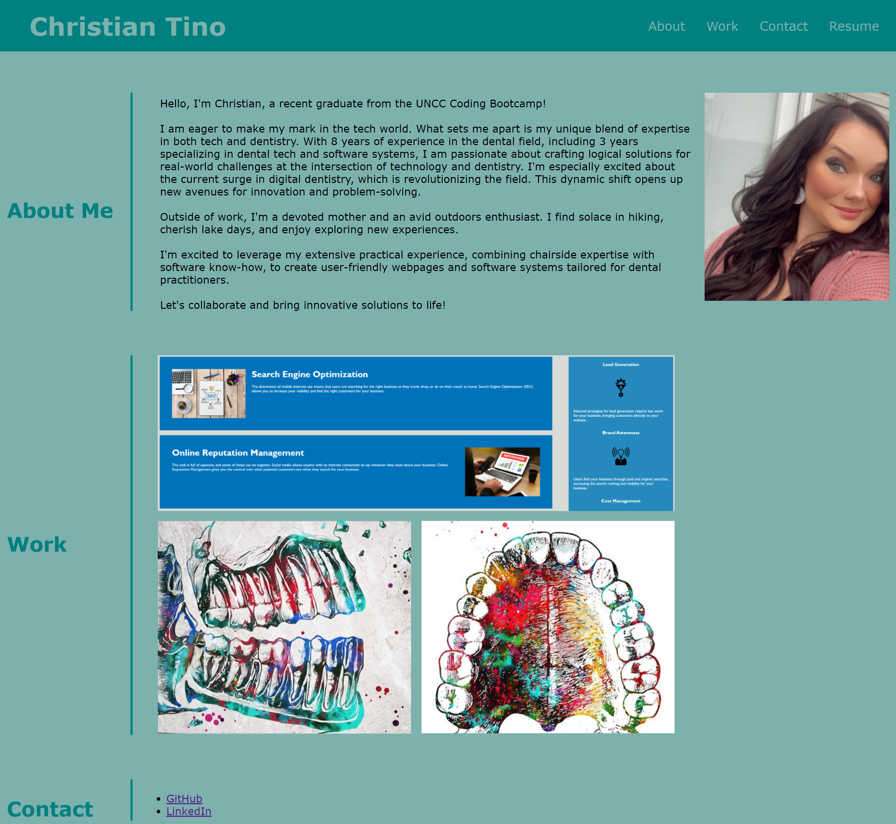

# Christian Tino Portfolio

## Description
Motivation
- As an employer, it is crucial to be able to easily access and review a potential employee's portfolio of work samples. This ensures that I can thoroughly evaluate their skills and determine if they are a suitable candidate for an open position.

Purpose
- The purpose of this project is to create a user-friendly portfolio that provides all the necessary information for a hiring manager. This includes the developer's name, a recent photo or avatar, and easy navigation to sections about the developer, their work, and how to contact them.

Problems
- The key challenges to address in this project were ensuring smooth navigation to relevant sections and presenting work samples in an organized manner. The layout must also be responsive to accommodate various screen sizes and devices.

Learnings
- Through this project, I gained valuable insights into the importance of user-centric design for potential employers. It highlighted the significance of clear and accessible information presentation. Additionally, I learned the necessity of creating a responsive layout to cater to different viewport sizes.

## Screenshot

## Links
[Live URL](https://xtianhope.github.io/christian-tino-portfolio/)